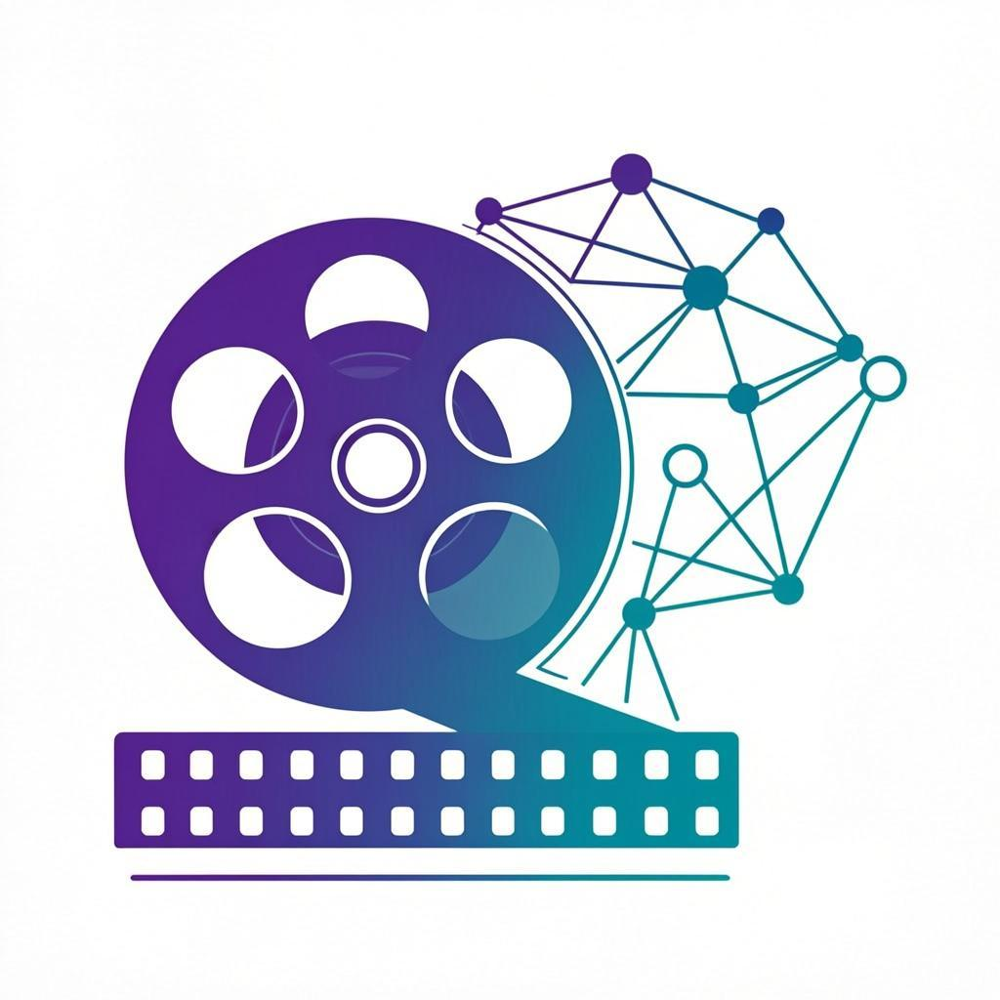

<p align="center">
  
</p>

<h1 align="center">DramaAI - AI短剧全流程设计平台</h1>

<p align="center">
  <strong>从创意构思到成片输出，AI 助你实现专业级短剧制作</strong><br/>
  剧本创作 · 角色生成 · 分镜设计 · 智能配音 · 视频合成 一站式完成
</p>

<p align="center">
  
  
  
  
  
  
</p>

<p align="center">
  <a href="#-功能预览">功能预览</a> ·
  <a href="#-技术架构">技术架构</a> ·
  <a href="#-快速开始">快速开始</a> ·
  <a href="#-项目结构">项目结构</a> ·
  <a href="#-开发计划">开发计划</a> ·
  <a href="#-贡献指南">贡献指南</a>
</p>

---

## 🎬 功能预览

DramaAI 是一个面向短剧创作者的 AI 全流程生产平台，覆盖从灵感到成片的完整工作流。

### 1️⃣ 项目仪表板

> 统一管理所有短剧项目，全局掌控创作进度

- 📊 项目概览统计（项目数、角色数、场景数、视频数）
- 🚀 快速操作入口（AI 创意构思、角色生成、场景设计、一键配音）
- 🎨 Hero 横幅展示平台能力
- 📁 项目卡片展示（封面图、题材标签、状态指示、进度统计）
- ➕ 一键创建新项目（支持 8 种题材分类）

### 2️⃣ 剧本工作室

> AI 辅助剧本创作，多模式智能写作

| 模式 | 说明 |
|------|------|
| 🧠 **创意构思** | 输入灵感关键词，AI 生成完整短剧大纲（标题、梗概、角色、反转点、目标受众） |
| 📝 **剧本生成** | 基于大纲自动扩展为完整第一集剧本（8-12 个场景，含角色对话） |
| 🎞️ **场景拆分** | 智能解析剧本，自动拆分为独立分镜场景（含画面描述、景别、氛围） |
| ✨ **优化润色** | AI 一键增强戏剧冲突、优化台词、丰富场景描写 |
| 💬 **自由对话** | 与 AI 编剧自由交流，获取创作建议和修改意见 |

- 左右分栏布局：AI 对话区 + 剧本编辑器
- 支持键盘快捷键 `⌘+Enter` 快速提交
- AI 响应自动解析为结构化卡片展示
- 剧本编辑器支持复制、保存、字数统计
- 一键"导入到场景"无缝衔接分镜设计

### 3️⃣ 角色工坊

> AI 驱动的角色形象设计与管理

- 👤 角色卡片网格展示（头像、姓名、角色类型、性格标签）
- 🤖 **AI 生成角色头像**：输入外貌描述，自动生成高质量角色肖像
- 🎭 完整角色属性：名称、角色类型（主角/配角/群演）、性别、年龄、外貌描述、性格特点
- 🎙️ 7 种配音音色绑定：温暖亲切、活泼可爱、沉稳专业、英音绅士、清晰标准、自然流畅、富有感染力
- 🎨 性别色彩编码（粉色/青色）和角色等级标签（金色/天蓝/灰色）
- ✏️ 编辑、删除、搜索角色

### 4️⃣ 分镜设计

> 专业级分镜画面设计与 AI 场景生成

- 🎬 **胶片条时间轴**：横向滚动的电影胶片风格场景导航
- 🖼️ **AI 场景画面生成**：基于场景描述自动生成 16:9 分镜画面
- 📐 完整场景属性：地点、时间段（白天/黄昏/夜晚/黎明）、氛围情绪（平静/紧张/浪漫/悲伤/欢快/悬疑）、景别（特写/近景/中景/全景/远景）、时长
- 🔄 **AI 批量场景拆分**：粘贴完整剧本，自动拆分为多个分镜场景
- ✏️ 场景对话编辑，支持从剧本导入
- 🖼️ 场景图片一键重新生成

### 5️⃣ 配音工作室

> 智能语音合成，多音色角色配音

- 🎙️ **7 种 AI 音色**：温暖亲切 / 活泼可爱 / 沉稳专业 / 英音绅士 / 清晰标准 / 自然流畅 / 富有感染力
- 🎵 **实时音频波形可视化**（40 通道波形动画）
- ⏩ 语速调节滑块（0.5x ~ 2.0x）
- 🎭 角色与场景对话绑定，按角色自动匹配音色
- 📋 场景对话列表，筛选"仅显示有对话的场景"
- 🔊 单场景试听 + 应用配音
- 📦 **批量配音生成**：一键为所有有对话的场景生成配音，实时进度追踪

### 6️⃣ 视频工厂

> AI 驱动的短剧视频合成

- 🎥 **文本转视频**：输入场景描述，AI 自动生成视频
- 🖼️ **图片转视频**：上传分镜图片，AI 生成动态视频
- ⚙️ 灵活的视频参数配置：
  - 质量：快速 / 高质量
  - 时长：5 秒 / 10 秒
  - 帧率：30 FPS / 60 FPS
  - 分辨率：最高 1920×1080
  - AI 音频效果开关
- 📊 场景视频生成状态追踪（未生成 / 生成中 / 已完成 / 失败）
- 📦 **批量视频生成**：选择多个场景一键批量合成，实时进度监控
- ▶️ 场景卡片内嵌视频预览播放器

### 7️⃣ 时间线与预览

> 全流程预览、时间线管理与项目导出

- ⏱️ **垂直时间轴**：可视化场景排列，编号节点连线展示
- 📊 **素材完成度追踪**：每个场景显示 🖼️ 场景图 / 🎬 视频 / 🔊 配音 完成状态
- 👁️ **双面板预览**：左侧时间轴 + 右侧实时预览（视频 > 图片 > 占位符）
- ▶️ **自动播放模式**：按场景时长自动轮播预览，带进度条指示
- ⬆️⬇️ 场景上下移动重排序
- 📤 **项目导出**：一键导出为 JSON 格式（含完整项目数据、场景、角色信息）
- 📈 项目完成度统计（场景数、角色数、总时长、完成百分比）

---

## 🏗️ 技术架构

### 架构总览

```
┌─────────────────────────────────────────────────────────┐
│                    Frontend (Next.js 16)                  │
│  ┌──────────┐ ┌──────────┐ ┌──────────┐ ┌──────────┐    │
│  │ Dashboard │ │  Script  │ │ Character│ │Storyboard│    │
│  └────┬─────┘ └────┬─────┘ └────┬─────┘ └────┬─────┘    │
│       │            │            │            │           │
│  ┌────┴─────┐ ┌────┴─────┐ ┌────┴─────┐ ┌────┴─────┐    │
│  │  Voice   │ │  Video   │ │ Timeline │ │ Sidebar  │    │
│  └────┬─────┘ └────┬─────┘ └────┬─────┘ └──────────┘    │
│       │            │            │                        │
│  ┌────┴────────────┴────────────┴────┐                   │
│  │        Zustand State Store        │                   │
│  └────────────────┬──────────────────┘                   │
├───────────────────┼──────────────────────────────────────┤
│                   │  API Routes (Next.js)                 │
│  ┌────────────────┴──────────────────┐                   │
│  │ /api/generate-script  (LLM)       │                   │
│  │ /api/generate-image   (Image Gen) │                   │
│  │ /api/generate-tts     (TTS)       │                   │
│  │ /api/generate-video   (Video Gen) │                   │
│  │ /api/projects         (CRUD)      │                   │
│  │ /api/characters       (CRUD)      │                   │
│  │ /api/scenes           (CRUD)      │                   │
│  └────────────────┬──────────────────┘                   │
├───────────────────┼──────────────────────────────────────┤
│              z-ai-web-dev-sdk                             │
│         (LLM · Image · TTS · Video)                       │
├──────────────────────────────────────────────────────────┤
│              Prisma ORM → SQLite                          │
├──────────────────────────────────────────────────────────┤
│              Framer Motion · Tailwind CSS 4 · shadcn/ui  │
└──────────────────────────────────────────────────────────┘
```

### 技术栈

| 类别 | 技术 | 说明 |
|------|------|------|
| **核心框架** | Next.js 16 (App Router) | React 全栈框架，服务端渲染 + API Routes |
| **语言** | TypeScript 5 | 严格类型检查 |
| **UI 组件** | shadcn/ui (New York) | 50+ 可定制 UI 组件 |
| **样式** | Tailwind CSS 4 | 原子化 CSS，JIT 编译 |
| **动画** | Framer Motion | 页面切换、组件动画 |
| **状态管理** | Zustand 5 | 轻量级客户端状态管理 |
| **数据库** | Prisma ORM + SQLite | 类型安全的数据库操作 |
| **AI SDK** | z-ai-web-dev-sdk | LLM / Image Gen / TTS / Video Gen |

### 数据模型

```
DramaProject (短剧项目)
├── Character (角色)      : 名称、类型、性别、外貌、性格、头像、音色
├── DramaScene (场景/分镜) : 标题、描述、对话、地点、时间、氛围、景别、图片、视频、音频
└── Episode (剧集)        : 标题、集数、梗概、剧本
```

### API 端点

| 方法 | 端点 | 说明 |
|------|------|------|
| `GET/POST/PUT/DELETE` | `/api/projects` | 项目 CRUD |
| `GET/POST/PUT/DELETE` | `/api/characters` | 角色 CRUD |
| `GET/POST/PUT/DELETE` | `/api/scenes` | 场景 CRUD |
| `POST` | `/api/generate-script` | LLM 剧本生成 |
| `POST` | `/api/generate-image` | AI 图片生成 |
| `POST` | `/api/generate-tts` | TTS 语音合成 |
| `POST/GET` | `/api/generate-video` | 视频生成 + 状态轮询 |

---

## 🚀 快速开始

### 环境要求

- **Node.js** >= 18
- **Bun** >= 1.0（推荐）

### 安装与启动

```bash
# 1. 克隆仓库
git clone https://github.com/dav-niu474/Drama-AI.git
cd Drama-AI

# 2. 安装依赖
bun install

# 3. 配置环境变量
cp .env.example .env.local
# 编辑 .env.local 填入必要配置

# 4. 初始化数据库
bun run db:push

# 5. 启动开发服务器
bun run dev
```

打开浏览器访问 `http://localhost:3000`

### 环境变量

```env
# 数据库连接（SQLite，默认即可）
DATABASE_URL="file:./db/custom.db"

# AI SDK 配置（如需自定义）
ZAI_API_KEY="your_api_key"
ZAI_BASE_URL="https://api.z-ai.chat"
```

### 常用命令

```bash
bun run dev          # 启动开发服务器
bun run lint         # ESLint 代码检查
bun run db:push      # 同步数据库 Schema
bun run db:generate  # 生成 Prisma Client
bun run db:migrate   # 运行数据库迁移
```

---

## 📁 项目结构

```
Drama-AI/
├── prisma/
│   └── schema.prisma              # 数据库模型定义
├── public/
│   └── images/                    # 静态图片资源
│       ├── logo.png               # 平台 Logo
│       ├── hero.png               # Hero 横幅
│       ├── char-sample-*.png      # 角色示例图
│       └── scene-sample-*.png     # 场景示例图
├── src/
│   ├── app/
│   │   ├── layout.tsx             # 根布局
│   │   ├── page.tsx               # 主页面（工作流路由）
│   │   ├── globals.css            # 全局样式 & 主题变量
│   │   └── api/
│   │       ├── projects/route.ts       # 项目管理 API
│   │       ├── characters/route.ts     # 角色管理 API
│   │       ├── scenes/route.ts         # 场景管理 API
│   │       ├── generate-script/route.ts # LLM 剧本生成
│   │       ├── generate-image/route.ts  # AI 图片生成
│   │       ├── generate-tts/route.ts    # TTS 语音合成
│   │       └── generate-video/route.ts  # 视频生成 + 轮询
│   ├── components/
│   │   ├── drama/
│   │   │   ├── sidebar.tsx              # 侧边栏导航
│   │   │   ├── dashboard.tsx            # 项目仪表板
│   │   │   ├── script-studio.tsx        # 剧本工作室 (1,146 行)
│   │   │   ├── character-workshop.tsx   # 角色工坊 (904 行)
│   │   │   ├── storyboard-designer.tsx  # 分镜设计 (1,217 行)
│   │   │   ├── voice-studio.tsx         # 配音工作室 (1,281 行)
│   │   │   ├── video-factory.tsx        # 视频工厂 (1,313 行)
│   │   │   └── timeline-preview.tsx     # 时间线预览 (976 行)
│   │   └── ui/                    # shadcn/ui 组件库 (50+)
│   ├── store/
│   │   └── drama-store.ts         # Zustand 全局状态
│   ├── hooks/                     # 自定义 Hooks
│   └── lib/
│       ├── db.ts                  # Prisma 数据库客户端
│       └── utils.ts               # 工具函数 (cn)
├── .gitignore
├── components.json                # shadcn/ui 配置
├── tailwind.config.ts
├── tsconfig.json
├── next.config.ts
├── eslint.config.mjs
├── package.json
├── bun.lock
└── README.md
```

### 代码规模

```
前端业务组件:    ~7,864 行  (8 个核心模块)
后端 API 路由:     ~688 行  (7 个端点)
状态管理:          ~169 行  (Zustand Store)
shadcn/ui 组件:  ~12,000+ 行 (50+ 组件)
─────────────────────────────
合计业务代码:   ~20,000+ 行
```

---

## 🗺️ 开发计划

### ✅ Phase 1 - 核心平台 MVP（已完成）

| 功能 | 状态 | 说明 |
|------|:----:|------|
| 项目管理 | ✅ | 创建、编辑、删除、列表展示 |
| AI 剧本创作 | ✅ | 5 种模式：创意构思 / 剧本生成 / 场景拆分 / 优化润色 / 自由对话 |
| AI 角色形象 | ✅ | 角色管理 + AI 头像生成 |
| AI 分镜设计 | ✅ | 场景 CRUD + AI 画面生成 + 批量拆分 |
| AI 智能配音 | ✅ | 7 种音色 TTS + 批量配音 + 波形可视化 |
| AI 视频合成 | ✅ | 文本/图片转视频 + 参数配置 + 批量生成 |
| 时间线预览 | ✅ | 垂直时间轴 + 自动播放 + 项目导出 |

### 🔄 Phase 2 - 体验升级（进行中）

| 功能 | 状态 | 说明 |
|------|:----:|------|
| 用户认证系统 | 🔜 | NextAuth.js 集成，支持 GitHub / 邮箱登录 |
| 多人协作 | 🔜 | 实时协同编辑，WebSocket 同步 |
| 版本管理 | 🔜 | 剧本/场景版本历史，支持回滚 |
| 拖拽排序 | 🔜 | @dnd-kit 场景拖拽重排 |
| 撤销/重做 | 🔜 | 全局 Undo/Redo 操作栈 |
| 暗色模式 | 🔜 | 完整暗色主题适配 |
| 国际化 | 🔜 | next-intl 多语言支持（中/英） |

### 📋 Phase 3 - 专业生产

| 功能 | 状态 | 说明 |
|------|:----:|------|
| 多集管理 | 🔜 | 剧集系统完善，集间跳转 |
| 音效库 | 🔜 | 内置音效素材库，AI 匹配音效 |
| BGM 生成 | 🔜 | AI 背景音乐生成（情绪/节奏匹配） |
| 字幕系统 | 🔜 | AI 字幕生成 + 时间轴对齐 |
| 画面风格迁移 | 🔜 | AI 将分镜转为指定画风（动漫/写实/水彩等） |
| 口型同步 | 🔜 | AI 唇形与配音自动同步 |
| 视频模板 | 🔜 | 预设短剧模板（竖屏/横屏/方屏） |

### 🔮 Phase 4 - 智能化与分发

| 功能 | 状态 | 说明 |
|------|:----:|------|
| AI 导演助手 | 🔜 | 全流程智能推荐（配乐/节奏/转场） |
| 智能剪辑 | 🔜 | AI 自动剪辑 + 转场效果 |
| 一键成片 | 🔜 | 全自动从剧本到成品视频 |
| 多平台适配 | 🔜 | 自动裁剪适配抖音/快手/小红书比例 |
| 素材市场 | 🔜 | 角色/场景/BGM 素材交易市场 |
| 数据分析 | 🔜 | 观看数据分析 + 剧情优化建议 |
| API 开放平台 | 🔜 | 第三方接入能力 |
| 插件系统 | 🔜 | 自定义工作流插件 |

### 📅 里程碑时间线

```
2025 Q2  ██ Phase 1 MVP ✅ 已完成
2025 Q3  ██ Phase 2 体验升级
2025 Q4  ██ Phase 3 专业生产
2026 Q1  ██ Phase 4 智能化与分发
```

---

## 🛠️ 开发规范

### 代码风格

- **语言**: TypeScript 严格模式
- **组件**: 函数式组件 + Hooks
- **样式**: Tailwind CSS 原子类，禁用 indigo/blue 主色
- **状态**: 服务端数据用 Prisma，客户端状态用 Zustand
- **API**: RESTful 风格，统一 `{ success, data/error }` 响应格式
- **提交**: Conventional Commits（`feat:`, `fix:`, `docs:` 等）

### 分支策略

```
main          ← 生产发布
  └── develop ← 开发集成分支
        ├── feature/xxx
        ├── fix/xxx
        └── refactor/xxx
```

---

## 🤝 贡献指南

欢迎任何形式的贡献！请遵循以下流程：

1. **Fork** 本仓库
2. 创建功能分支：`git checkout -b feature/your-feature`
3. 提交更改：`git commit -m 'feat: 添加某功能'`
4. 推送分支：`git push origin feature/your-feature`
5. 提交 **Pull Request**

详细规范请参阅 [CONTRIBUTING.md](./CONTRIBUTING.md)

---

## 📄 License

本项目采用 [MIT License](./LICENSE) 开源协议。

---

<p align="center">
  Built with ❤️ by <strong>DramaAI Team</strong><br/>
  <sub>Powered by Next.js · TypeScript · Tailwind CSS · z-ai-web-dev-sdk</sub>
</p>
